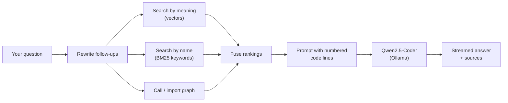

# 🚀 CodeWise – Intelligent Code Mentor AI

CodeWise is a private, local AI assistant that helps you **understand a codebase by asking it questions**. Load a project (files, a folder, a zip, or a GitHub repository), ask questions in plain English, and get answers grounded in your actual code, with the file names and line numbers they came from.

Everything runs on your own machine. **Qwen2.5-Coder** runs locally through **Ollama**, your code is indexed in a local **ChromaDB**, and nothing is sent to a cloud service.

> *"Who calls `process_pdf_pipeline`?"* · *"How does the upload flow work?"* · *"What depends on `store.py`?"*

---

# ✨ Features

**Bring in a whole project**
- 📂 Upload files, whole folders (drag and drop), or `.zip` archives
- 🐙 Import a GitHub repository by pasting its URL
- 🧹 Skips noise automatically: `node_modules`, `venv`, `.git`, lockfiles, minified bundles, and anything in your `.gitignore`

**Ask and get grounded answers**
- 💬 Plain-English questions, with follow-ups that understand "it" and "that"
- ⚡ Answers stream in word by word, with a **Stop** button
- 📄 Every answer lists its sources: file, line range, and function or class
- 🙅 Says so when the answer isn't in your code, instead of guessing

**Understand how code connects**
- 🔗 Maps which functions call which, and which files import which
- 🎯 Answers *"who calls X?"* and *"what depends on this file?"* from the real structure of the code

**Review the whole project**
- 📊 **AI Code Audit**: architecture, patterns, code quality and security concerns across the project

---

# 🧠 How it works



1. **Structure-aware chunking.** Code is split into whole functions and classes (Python by syntax tree; JS/TS, Java, Go, Rust, C/C++ by code blocks), not arbitrary slices.
2. **Code-aware embeddings.** `nomic-embed-text` turns each chunk, labelled with its file, function and lines, into a vector stored in ChromaDB.
3. **Hybrid search.** Meaning-based search, keyword search that understands `snake_case` and `camelCase`, and the call/import graph are combined with Reciprocal Rank Fusion.
4. **Grounded prompts.** The best chunks are sent with real line numbers, fitted to the model's context window.
5. **Local generation.** Qwen2.5-Coder writes the answer, which streams back to the browser.

Details: [Architecture guide](docs/architecture.md).

---

# ⚙️ Quick start

You'll need **Python 3.10+**, **Node.js 20.19+**, and **[Ollama](https://ollama.com)**.

```bash
# 1. Models (one time)
ollama pull qwen2.5-coder:7b
ollama pull nomic-embed-text

# 2. Backend
git clone https://github.com/shekharsanskar9/CodeWise.git
cd CodeWise
python -m venv venv && source venv/bin/activate
pip install -r requirements.txt
python backend.py                 # http://127.0.0.1:8000

# 3. Frontend (second terminal)
cd frontend
npm install
npm run dev                       # open http://localhost:5173
```

Then click **Create Project**, upload some code, and start asking.

> 💡 On a Mac, the backend uses port **8000** because macOS reserves 5000 for AirPlay Receiver.

To change models, limits or ports, copy `.env.example` to `.env` and edit it. See [Configuration](docs/configuration.md).

---

# 📚 Documentation

| Guide | What's inside |
|---|---|
| [Architecture](docs/architecture.md) | Components, upload and question flows, code graph, data storage, design decisions |
| [API reference](docs/api.md) | Every endpoint with request/response examples |
| [Configuration](docs/configuration.md) | All settings and when to change them |
| [Development](docs/development.md) | Dev setup, tests, where to make common changes |
| [Evaluation](docs/evaluation.md) | Measuring search and answer quality |
| [Troubleshooting](docs/troubleshooting.md) | Fixes for common problems |

There's also a friendlier overview in the [project wiki](https://github.com/shekharsanskar9/CodeWise/wiki).

---

# 🛠 Technology Stack

| Layer | Tools |
|---|---|
| **Backend** | Python, Flask, ChromaDB, SQLite |
| **Models** | Ollama · Qwen2.5-Coder 7B (answers) · nomic-embed-text (search) |
| **Frontend** | React, Vite, Tailwind CSS, Lucide icons |
| **Quality** | pytest (~90 tests), retrieval and answer-quality evaluation |

```
backend.py         Entry point
codewise/          Backend package: ingestion, search, prompts, code graph, API
frontend/          React app
tests/             pytest suite (runs without Ollama)
eval/              Retrieval and answer-quality evaluation
docs/              Documentation
```

---

# 📌 Supported Languages

Python, JavaScript, TypeScript, Java, Kotlin, C, C++, C#, Go, Rust, PHP, Ruby, Swift, SQL, plus HTML, CSS, JSON, YAML, TOML, XML and Markdown.

Structure-aware chunking and the call/import graph are most accurate for **Python**, then **JavaScript/TypeScript**.

---

# ⚠️ Limitations

- **Slower than cloud tools.** About 20–40 seconds per answer on an M4 MacBook with 16 GB. That's the cost of running a 7B model locally.
- **A small model is still a small model.** Great at explaining and finding code, weaker at deep reasoning across many files, and it occasionally gets a path slightly wrong. Always check the sources.
- **Calls are matched by name.** Two functions both called `save` are treated as one, and dynamic calls aren't detected.
- **A snapshot of your code.** After editing, upload the changed files again.
- **No user accounts.** It's built to run on your own machine, not on the public internet.

---

# 🗂 Version History

| Version | Highlights |
|---|---|
| **1.0** | First working version: upload files, ask questions, answers with sources |
| **[2.0](https://github.com/shekharsanskar9/CodeWise/releases/tag/v2.0)** | Rebuilt search: structure-aware chunking, code-aware embeddings, hybrid search, follow-up rewriting, correct line numbers, saved project data, tests |
| **[3.0](https://github.com/shekharsanskar9/CodeWise/releases/tag/v3.0)** | Folder, zip and GitHub import; streaming answers; call/import graph; answer-quality evaluation |

---

# 🎯 Future Improvements

- Remember the open project across page reloads, and list or delete projects
- Background imports with progress for very large repositories
- Optional hosted model for users who prefer speed over privacy
- Re-index only the files that changed
- VS Code extension
- Docker deployment

---

# 👨‍💻 Author

**Sanskar Shekhar**

Computer Science Engineer

AI • Machine Learning • Full Stack Development

---

# ⭐ Project Goal

The objective of CodeWise is to enable developers to interact with their codebase using natural language. By combining Retrieval-Augmented Generation with hybrid search, a code graph and a locally hosted LLM, CodeWise delivers accurate, context-aware answers grounded in the uploaded source code, without the code ever leaving your machine.
