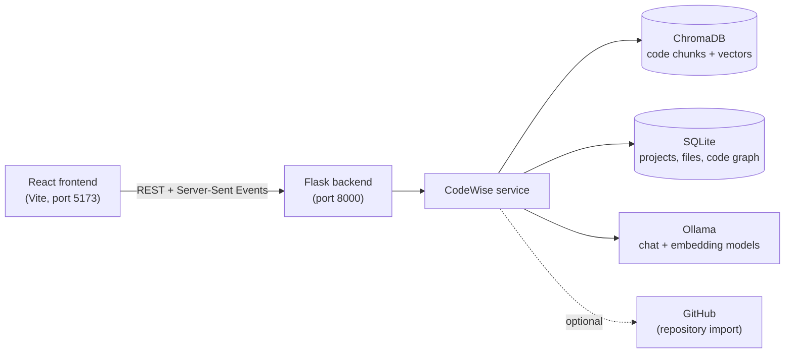
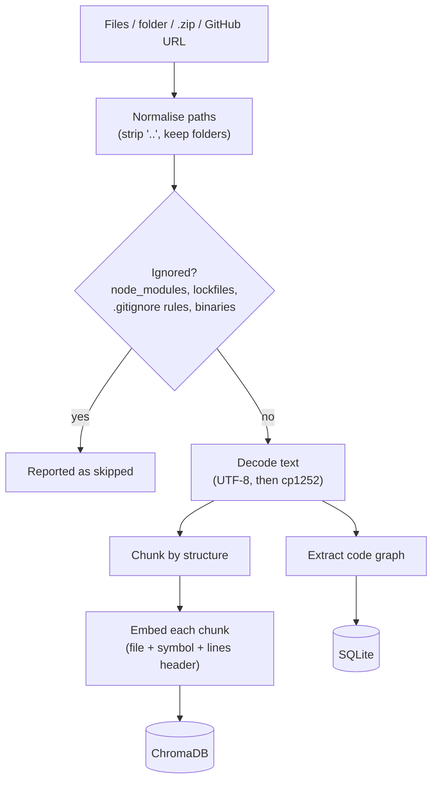
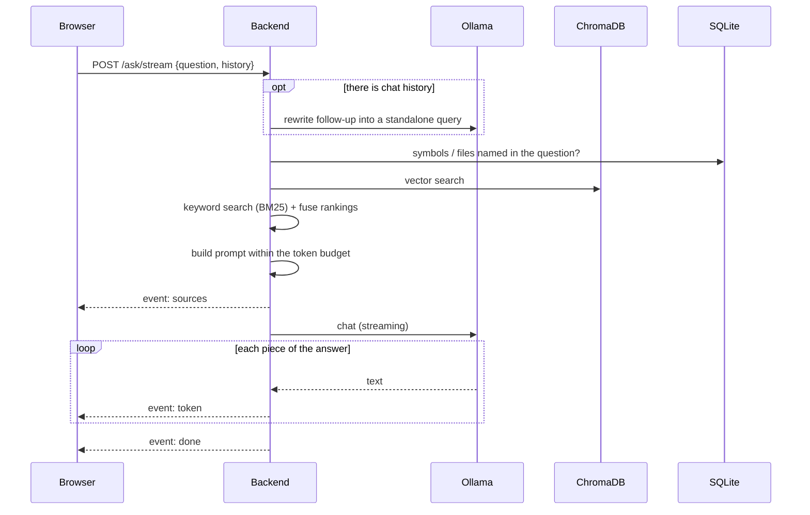
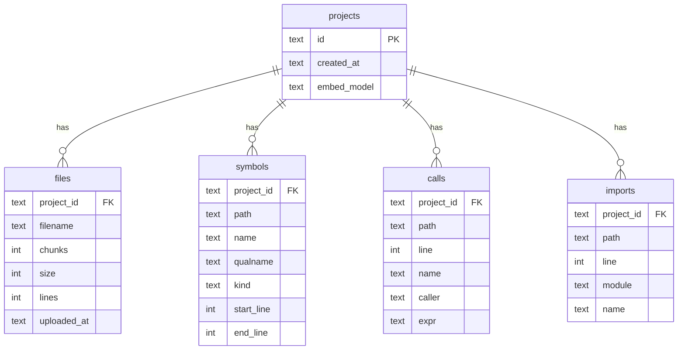

# Architecture

This page explains how CodeWise is put together: the main components, what happens when you upload code, what happens when you ask a question, and where data is stored.

- [The big picture](#the-big-picture)
- [Code layout](#code-layout)
- [What happens on upload](#what-happens-on-upload)
- [What happens when you ask a question](#what-happens-when-you-ask-a-question)
- [Project analysis](#project-analysis)
- [Where data lives](#where-data-lives)
- [Design decisions](#design-decisions)

---

## The big picture



| Component | Job |
|---|---|
| **React frontend** | Upload panel (files, folders, zip, GitHub URL), chat with streaming answers, source chips |
| **Flask backend** | Thin HTTP layer: validates requests, maps errors to status codes, streams answers |
| **CodeWise service** | All the logic: ingestion, retrieval, prompt building, analysis |
| **ChromaDB** | Stores every code chunk with its embedding; answers "which chunks mean something similar?" |
| **SQLite** | Stores projects, file lists and the code graph (definitions, calls, imports) |
| **Ollama** | Runs the models locally: `qwen2.5-coder:7b` writes answers, `nomic-embed-text` makes embeddings |

Everything runs on one machine. The only outside network request CodeWise makes is when you ask it to import a GitHub repository.

---

## Code layout

```
backend.py              Entry point: builds the app from config and runs it
codewise/
  config.py             All settings, read from environment variables
  app.py                Flask routes and error handling (thin)
  service.py            The CodeWise class: upload, ask, analyze, graph
  files.py              Upload rules: supported types, ignored folders, decoding
  sources.py            Folders, zip archives, GitHub downloads, .gitignore rules
  chunking.py           Splits files into chunks that follow code structure
  embeddings.py         Embedding models (Ollama, with a built-in fallback)
  index.py              ChromaDB access for a project
  retrieval.py          BM25 keyword search and hybrid fusion
  graph.py              Extracts definitions, calls and imports from code
  relations.py          Turns the code graph into prompt context and search hints
  llm.py                Prompts, token budgeting, Ollama chat wrapper
  store.py              SQLite: projects, files, code graph
frontend/src/
  App.jsx               The whole UI
  lib/uploads.js        Folder traversal, client-side filtering, batched uploads
  lib/stream.js         Reads streamed answers (Server-Sent Events over POST)
tests/                  pytest suite (runs without Ollama, using fake models)
eval/                   Retrieval and answer-quality evaluation scripts
```

The rule of thumb: `app.py` only deals with HTTP, and everything else lives in `service.py` and the modules it uses. This keeps the logic testable without a web server, and makes it possible to swap Flask for another framework by rewriting one file.

---

## What happens on upload



1. **Collecting files.** Plain uploads keep their relative paths, so `src/utils.py` and `tests/utils.py` stay separate. Zip archives are unpacked on the server with safety limits. GitHub repositories are downloaded as a zip through the GitHub API. The frontend also skips unsupported and ignored files *before* uploading, to avoid sending `node_modules` over the network.
2. **Filtering.** Files are rejected if they're in an ignored folder (`node_modules`, `.git`, `venv`, `dist`, …), are lockfiles or minified bundles, have an unsupported extension, are too large, look binary, or match a `.gitignore` included in the upload.
3. **Chunking** (`chunking.py`). Files are cut along their structure, not at fixed sizes:
   - **Python** is parsed with `ast`. Each top-level function or class becomes a segment, with decorators and the comments above it attached. Large classes are split into one segment per method.
   - **C-like languages** (JS/TS, Java, C/C++, C#, Go, Rust, PHP, Swift, Kotlin, CSS) are split where top-level `{ … }` blocks close.
   - **Markdown** is split at headings.
   - Small neighbouring segments are packed together up to `CODEWISE_CHUNK_MAX_CHARS`. Segments that are still too big are split into overlapping line windows.
   - Every chunk records its 1-based line range and the names of the functions or classes it contains.
4. **Embedding** (`embeddings.py`). Each chunk is embedded together with a small header (`File: …`, `Symbol: …`, `Lines: …`), so the vector also carries *where* the code lives. The default model is `nomic-embed-text` via Ollama. If it isn't installed, CodeWise falls back to ChromaDB's built-in `all-MiniLM-L6-v2`, which is much weaker on code.
5. **Code graph** (`graph.py`). The same file is scanned for definitions, calls and imports (see [Code relationships](#code-relationships) below).
6. **Re-uploads replace.** Uploading a file that already exists first deletes its old chunks and graph rows, so old and new code never mix.

---

## What happens when you ask a question



1. **Clean the input.** The question is validated (at most 4,000 characters). The chat history is filtered to `user` and `assistant` turns only, so a client can't inject a `system` message.
2. **Rewrite follow-ups.** If there's history, the model rewrites a question like *"how does it handle errors?"* into a standalone search query that names what "it" refers to. Set `CODEWISE_REWRITE_QUERIES=false` to skip this extra model call.
3. **Find relationships.** If the question names a known function or class (for example `` `replace_file` `` or `ProjectIndex.search`) or a file (`store.py`), CodeWise looks up its definitions, call sites, importers and callees in the code graph.
4. **Search three ways and fuse** (`retrieval.py`):
   - **Vector search** finds chunks with similar meaning. Hits with a cosine distance above `CODEWISE_MAX_DISTANCE` are dropped.
   - **Keyword search (BM25)** finds exact identifiers. The tokenizer splits `snake_case` and `camelCase`, so `chunkCode` also matches "chunk" and "code". The long tail of weak matches is cut.
   - **Graph locations** add the chunks that contain the definitions and call sites found in step 3.
   - Files named in the question get their best chunks added too.

   The ranked lists are combined with **Reciprocal Rank Fusion**: each chunk scores `1 / (60 + rank)` in every list it appears in. The top `CODEWISE_TOP_K` chunks are kept.
5. **Build the prompt within a budget** (`llm.py`). The prompt must fit in `CODEWISE_NUM_CTX` tokens with `CODEWISE_ANSWER_RESERVE` left for the answer. Otherwise Ollama silently cuts the *start* of the prompt, which is the system prompt. Roughly 15% of the space goes to the relationships section, up to 70% to code, and the rest to the most recent chat history. Every code line is prefixed with its real line number (`42 | def foo():`), so the model can cite lines accurately. If nothing relevant was found, the prompt says so, and the model is told to admit it rather than guess.
6. **Stream the answer.** `/ask/stream` sends the sources first, then the answer piece by piece. If the browser disconnects (the Stop button), generation stops.

### Code relationships

`graph.py` extracts three things from every file:

| | Python | JavaScript / TypeScript | Other brace languages |
|---|---|---|---|
| **Definitions** | functions, classes, methods (via `ast`, exact scopes) | functions, arrow functions, classes, class methods | functions and classes by pattern |
| **Calls** | every call with its enclosing function | calls and JSX components (`<Button>`) | calls by pattern |
| **Imports** | `import` / `from … import`, relative imports resolved | `import`, multi-line imports, `require` | Java/Kotlin `import`, C/C++ `#include`, Go, Rust `use`, C# `using` |

Imports are resolved to project files where possible (`from .store import X` → `codewise/store.py`, `./utils` → `src/utils/index.js`).

**Limitation:** calls are matched **by name**. "Who calls `save`?" returns callers of every function named `save`. Dynamic calls (callbacks, `getattr`, reflection) aren't seen. The prompt tells the model about this limitation.

---

## Project analysis

**Generate AI Code Audit** (`GET /analyze`) works differently from questions:

1. Files are ordered: README first, then dependency manifests (`requirements.txt`, `package.json`, …), then entry points (`main`, `app`, `server`, `index`, …), then other source files by size.
2. **Small projects:** everything that fits in the context window is sent in one prompt (`mode: "full"`).
3. **Large projects:** the README and manifests are included as-is, the top 8 source files are each summarized separately, and the summaries are combined in a final prompt (`mode: "map_reduce"`). This makes about 10 model calls, so expect a few minutes.

---

## Where data lives

| Data | Location | Notes |
|---|---|---|
| Code chunks + embeddings | `chroma_data/` (`CODEWISE_CHROMA_PATH`) | One ChromaDB collection per project, named `project_<uuid>` |
| Projects, files, code graph | `codewise.db` (`CODEWISE_DB_PATH`) | SQLite |
| Question log (opt-in) | `CODEWISE_QUESTION_LOG` | JSON Lines; off by default |

Both paths are relative to the folder you start the backend from.

### ChromaDB

Each collection's metadata records `hnsw:space = cosine` and `embed_model`, the embedding model that built it. Querying a collection with a different model returns **409**, because vectors from different models can't be compared. Each chunk stores:

| Field | Example |
|---|---|
| document | the raw code |
| `filename` | `codewise/service.py` |
| `chunk_index` | `3` |
| `start_line`, `end_line` | `148`, `169` (1-based, inclusive) |
| `symbol` | `CodeWise._ingest` |
| `file_type` | `python` |

Chunk IDs combine a hash of the path, the chunk's position and a hash of its content. Identical code in two files therefore gets two separate entries.

### SQLite schema



- `symbols.kind` is `function`, `class` or `method`.
- `calls.caller` is the qualified name of the enclosing function, or `<module>`.
- `imports.module` is a dotted module name (Python), `path:<file without extension>` (relative JS imports), `file:<path>` (C includes) or a package name.

**Projects created before v2.0** exist only in ChromaDB. The first time they're accessed, their file list is rebuilt from the chunk metadata. They have no code graph until their files are uploaded again.

---

## Design decisions

**Why local-only?** Code is often private: company code, client work, unreleased projects. Running the models through Ollama means nothing leaves the machine. The cost is speed and answer quality, since a 7B model on a laptop is slower and less capable than a hosted model.

**Why hybrid search instead of vectors alone?** Vector search is good at meaning but poor at exact names: "where is `chunk_code` called?" needs the identifier to match exactly. Keyword search is the opposite. Fusing both, plus the code graph for relationship questions, covers each method's blind spots. On CodeWise's own code, hybrid search ranked the right file higher than either method alone (see [Evaluation](evaluation.md)).

**Why chunk by structure?** Fixed-size windows cut functions in half, so neither half makes sense on its own. Structure-aware chunks keep whole functions together and carry their names.

**Why SQLite for metadata?** The original version kept project data in a Python dictionary, so it vanished on restart. SQLite needs no setup, survives restarts, and handles the code graph's lookups with simple indexed queries.

**Why a thin HTTP layer?** All logic is in `service.py`, so it can be tested directly with fake models, and the web framework is a detail that can change.
